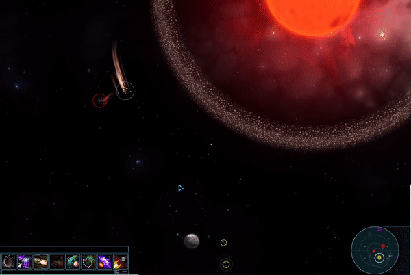

# Mnemonic Sensors

A Starsector mod that marks known sensor signatures with a circle, making it easier to identify that a sensor ping is just
a cargo pod full of metal that you left behind rather than some shiny loot.

## Changelog

- 0.1.0: initial release
- 0.1.1: fix issue with circles showing in GUIs, prettier circles
- 0.2.0: add different colors for different object types