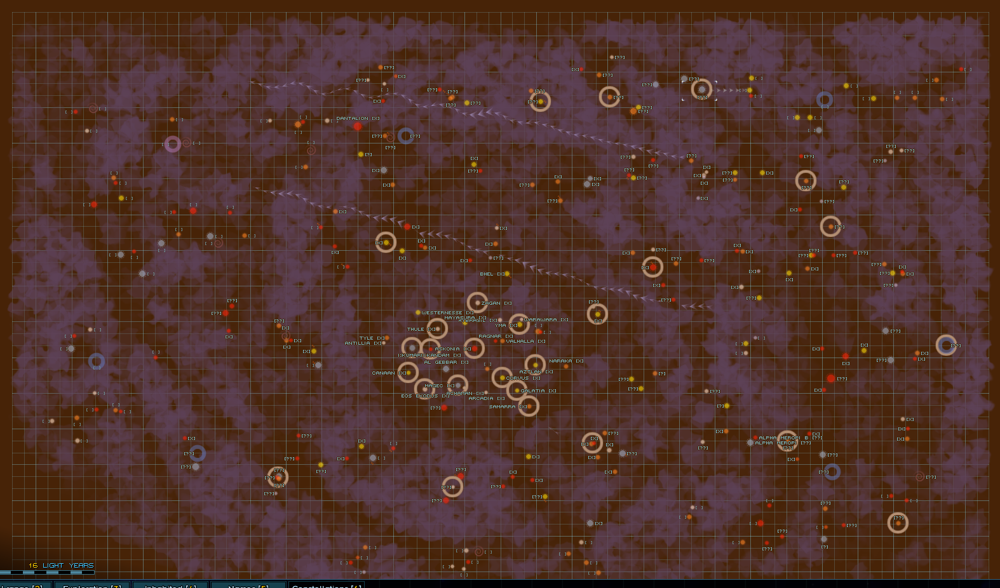
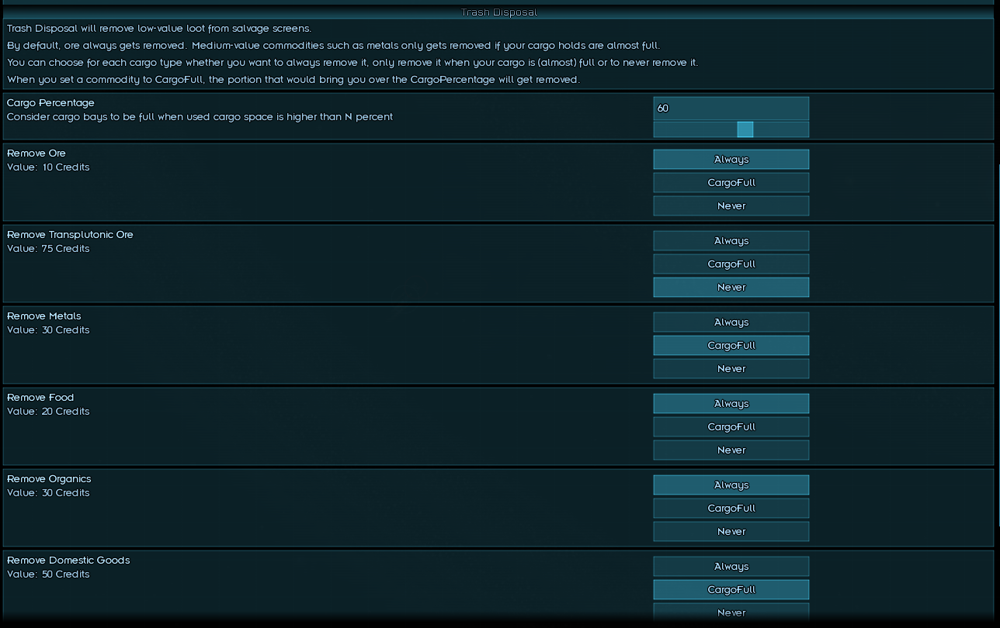
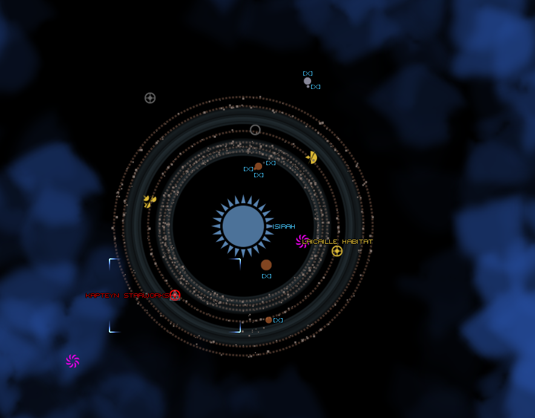

# Mnemonic Utils

A collection of quality of life improvements for exploration. Each feature can be individually turned on/off via 
LunaSettings.

# Features

## Mnemonic Sensors

Marks known sensor signatures with a circle, making it easier to identify that a sensor blip is just 
a cargo pod full of metal that you left behind rather than some shiny loot or hostile fleet.

## Gate Markers

Indicate systems that have a gate with a marker on the star map (when not in Starscape view) to make route-planning easier. 

## Trash Disposal

Removes low-value commodities, such as ore, from the loot screen when your cargo bays are close to full. 
Fully customizable via LunaSettings.

## Grid-less system maps

Remove the grid from system maps, making it easier to spot things. Feature was pitched and implemented by Genir, 
many thanks to Genir for contributing it to this mod!

## Garage for rent

Adds a bar event to player-owned colonies that lets you store your fleet. While parked, non-quest fleets can't interact 
with your fleet, you cannot move and supply usage is reduced. This is intended for passing time. Saving while your fleet 
is parked is not recommended.

If, for some reason, you are ever unable to visit the bar to retrieve your fleet, you can use the console command gfs_unpark.

This feature was requested and sponsored by Mythic.

The image used in the event was generated using [Craiyon](https://craiyon.com). If anyone wants to contribute a 
human-generated replacement image, that would be much appreciated!
